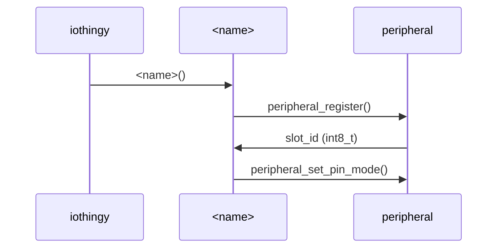
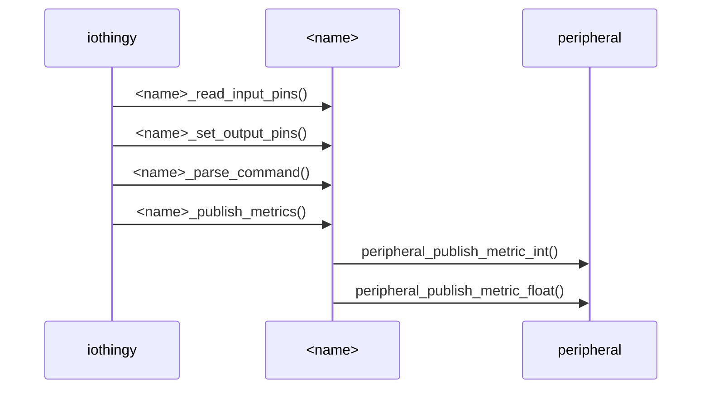

# Process flow
The **IoThingy** framework will call a couple of methods per defined peripheral
every iteration. Each peripheral must have a constructor method. Next the
framework will call the *&lt;name&gt;_read_input_pins*, *&lt;name&gt;_set_output_pins*,
*&lt;name&gt;_parse_command and *&lt;name&gt;_publish_metrics* methods.

## Initialisation
During the initialisation phase the method *iothingy_peripherals()* is called
which calls a constructor method for each of the defined peripherals. Every
peripheral initializes the variables using arguments and defaults. It also must
configure the mode (OUTPUT, INPUT or INPUT_PULLUP) for every pin used.

Registering a peripheral returns a slot_id which references the array element
of the peripherals data structure. The slot_id is required for almost every
method of a peripheral.

## Runtime
During runtime the device will call the following methods for every peripheral.
Looping the peripherals happens for every call: Meaning that first all input
pins are read, then the output will be set, parse commands and finally publish
the metrics.

