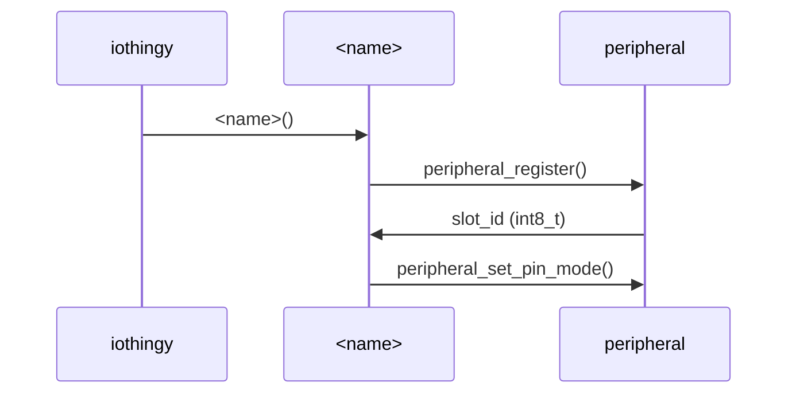
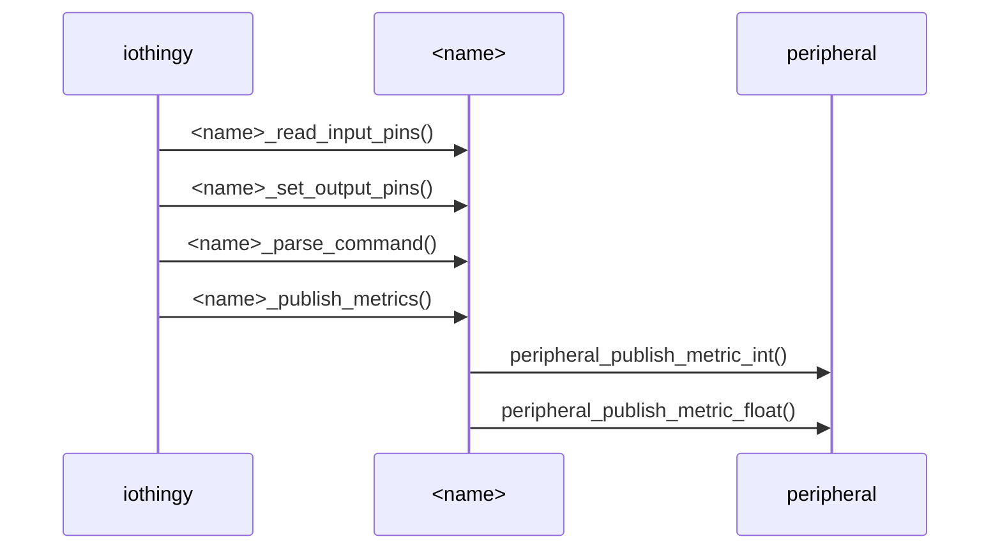

# Process flow
The **IoThingy** framework will call a couple of methods per defined peripheral
every iteration. Each peripheral must have a constructor method. Next the
framework will call the *&lt;name&gt;_read_input_pins*, *&lt;name&gt;_set_output_pins*,
*&lt;name&gt;_parse_command and *&lt;name&gt;_publish_metrics* methods.

## Initialisation

## Runtime
